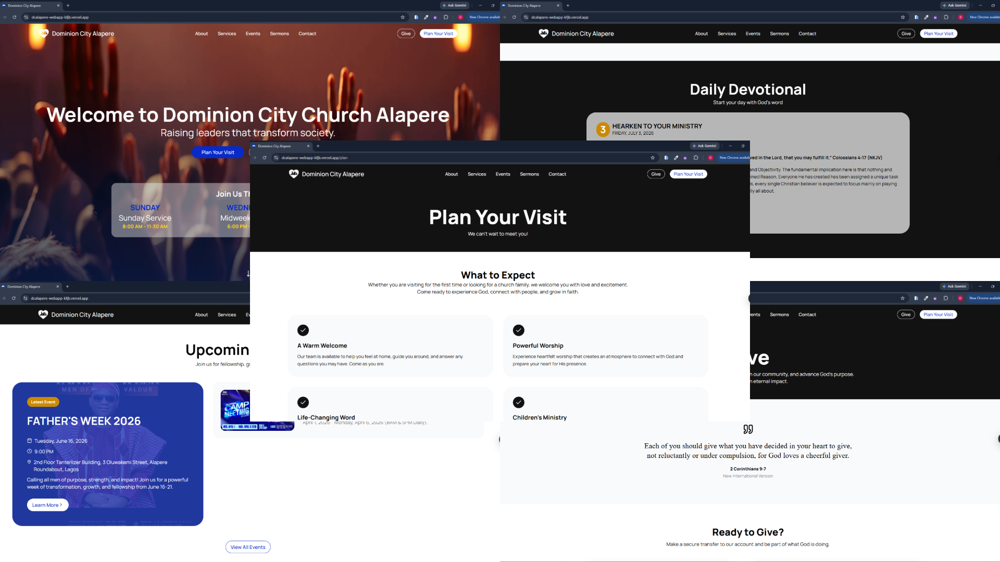

```markdown
# Dominion City Alapere Website


---

The official web platform for Dominion City Alapere, designed to help members and first-time visitors with information about the church, service schedules, online giving, planning a visit, contact information, and the Dominion Mandate Daily Devotional from any device.

The project also includes a backend automation service that synchronizes the latest daily devotional from Telegram to Supabase using GitHub Actions, ensuring fresh content is always available without manual updates.

---

## Live Demo

https://dcalapere-webapp-kfjb.vercel.app

---

## Screenshots



---

## Features

### Church Experience

- Home
- About
- Services
- Events
- Sermons
- Contact
- Give
- Plan Your Visit

### Daily Devotional

- Automatic Telegram synchronization
- Browser text-to-speech
- Daily updates via GitHub Actions

The Daily Devotional is synchronized from the official Dominion Mandate Telegram channel.

### Administration

- Secure admin authentication
- Event management
- Sermon management

### Technical

- Responsive design
- Supabase integration
- Component-based architecture

---

## Tech Stack

### Frontend

- React
- TypeScript
- Vite
- Styled Components
- Supabase JavaScript Client
- Lucide React
- Font Awesome

### Backend Automation

- Python
- Telethon
- Supabase Python Client
- GitHub Actions

### Database

- Supabase

### Deployment

- Vercel
- GitHub Actions

---

## System Architecture

```text
Telegram Channel
        │
        ▼
GitHub Actions
        │
        ▼
Python Fetch Script
        │
        ▼
Supabase Database
        │
        ▼
React Website
        │
        ▼
Website Visitors
```

---

## Project Structure

```text
dcalapere_webapp/
│
├── .github/
│   └── workflows/
│       └── telegram.yml
│
├── dcalapere/
│      ├── public/
│      ├── src/
│      │    ├── assets/
│      │    ├── components/
│      │    ├── layouts/
│      │    ├── pages/
│      │    ├── services/
│      │    ├── styles/
│      │    ├── utils/
│      │    └── App.tsx
│      ├──package.json
│      └── vite.config.ts
│
├── server/
│   ├── FetchDailyDevotional.py
│   ├── requirements.txt
│   └── README.md
│
└── README.md
```

---

## Getting Started

### Clone the Repository

```bash
git clone https://github.com/dominioncityalapere/dcalapere_webapp.git
```

Navigate into the project directory.

```bash
cd dcalapere_webapp
```

Install the project dependencies.

```bash
npm install
```

Start the development server.

```bash
npm run dev
```

---

## Environment Variables

Create a `.env` file in the project root.

```env
VITE_SUPABASE_URL=your_supabase_project_url
VITE_SUPABASE_ANON_KEY=your_supabase_anon_key
```

---

## Backend Automation

The `server` folder contains the Telegram synchronization service.

Responsibilities include:

- Connecting to Telegram
- Fetching the latest Dominion Mandate Daily Devotional
- Preventing duplicate records
- Saving devotionals to Supabase
- Running automatically with GitHub Actions

### Required GitHub Secrets

```
TG_API_ID
TG_API_HASH
TG_SESSION
SUPABASE_URL
SUPABASE_SERVICE_ROLE_KEY
```

---

## Running the Telegram Fetcher

Navigate into the server directory.

```bash
cd server
```

Install the Python dependencies.

```bash
pip install -r requirements.txt
```

Run the fetch script.

```bash
python FetchDailyDevotional.py
```

---

## Automated Devotional Workflow

```text
Telegram
    │
    ▼
GitHub Actions
    │
    ▼
FetchDailyDevotional.py
    │
    ▼
Supabase
    │
    ▼
React Application
```

Whenever a new devotional is published on Telegram, GitHub Actions automatically runs the fetch script, stores the devotional in Supabase, and makes it immediately available on the website.

---

## Deployment

Frontend: Vercel

Database: Supabase

Automation: GitHub Actions

Telegram Integration: Telethon

---

## Available Pages

- Home
- About
- Services
- Events
- Sermons
- Contact
- Give
- Plan Your Visit

---

## Administration

The project includes a secure administrator portal that is not publicly accessible.

Administrators can:

- Sign in securely
- Create events
- Add sermon videos

---

## Future Improvements

- Live streaming integration for services and special events
- Prayer request portal
- Online counselling or follow-up request form
- Push notifications for new devotionals and announcements
- Multi-language support
- Church gallery with photos and videos
- Testimonies section
- Online membership or first-time visitor form
- Newsletter subscription
- Search functionality for sermons

---

## Contributing

Contributions are welcome.

1. Fork the repository.
2. Create a feature branch.

```bash
git checkout -b feature/your-feature
```

3. Commit your changes.

```bash
git commit -m "Describe your changes"
```

4. Push your changes.

```bash
git push origin feature/your-feature
```

5. Open a Pull Request.

---

## License

This project is developed and maintained for Dominion City Alapere.

---

## Repository

Repository: <https://github.com/dominioncityalapere/dcalapere_webapp>

```

```
